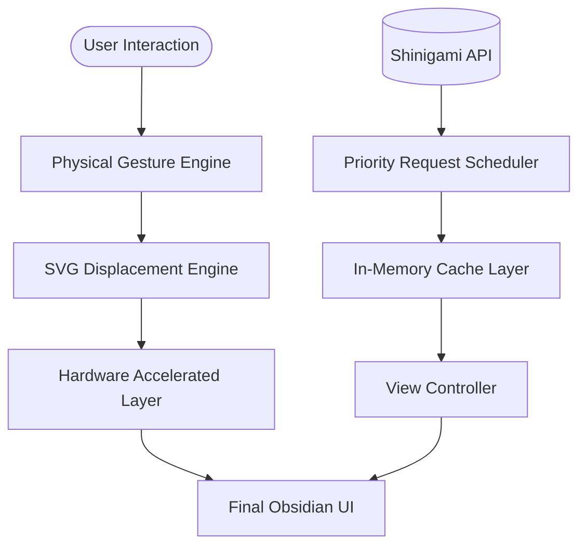

# VRTWEL COMICS — High-Craft Brutalist Manga Engine

<p align="center">
  
</p>

<p align="center">
  <a href="https://shngm.vercel.app/#/">
    
  </a>
</p>

<p align="center">
  
  
  
  
</p>

---

VRTWEL COMICS is a state-of-the-art, visually striking web application designed for the ultimate manga reading experience. It rejects generic "clean" UI in favor of a high-contrast **Brutalist Manga** aesthetic, powered by advanced hardware-accelerated optics and a professional-grade gesture engine.

---

## The Visual Experience

### 🧊 Liquid Glass Navigation
A revolutionary mobile navigation experience re-engineered using physical-grade UI interaction models.

| Component | Technical Specification |
| :--- | :--- |
| **Material** | Obsidian Acrylic (8px Gaussian Blur + Specular Rim) |
| **Optics** | Cylindrical Lens Displacement (SVG Displacement Maps) |
| **Physics** | Non-Linear Spring Dynamics (@vueuse/motion) |
| **Logic** | Spatial Collision Sensing (Native Element Sensing) |

### 🧿 Advanced Optical Engine
*   **Refraction Layer**: Real-time cylindrical stretch applied to content behind the navigation pill.
*   **Shadow Volume**: Deep 40px volumetric shadows providing physical presence.
*   **Luminosity Saturation**: 200% color boost for background content bleed-through.

---

## Core Engine Capabilities



### Performance Benchmarks
*   **Navigation Latency**: < 16ms (Input to Motion)
*   **Visual Fidelity**: 60 FPS under full refraction load
*   **API Efficiency**: Up to 500 chapters cached per series
*   **Initial Paint**: 0ms FOUC (Flash of Unstyled Content)

---

## Design System Tokens

VRTWEL COMICS utilizes a rigid, tactile design system inspired by traditional manga print technology.

### Color Palette
- `BG`: #09090b (Deep Obsidian)
- `SURFACE`: #18181b (Milled Gray)
- `ACCENT`: #e11d48 (Comic Red)
- `HIGHLIGHT`: #f59e0b (Safety Yellow)

### Typography
- **Heading**: `Outfit`, 900 Weight, -2px tracking
- **UI Text**: `Outfit`, 700 Weight, +1px spacing

---

## Internal Architecture

```text
Shngm/
├── src/
│   ├── components/       # High-Velocity Reusable UI
│   ├── views/           # Modular View Controllers
│   ├── api.js           # Resilience-First Data Layer
│   ├── style.css        # Token-Based Design System
│   └── App.vue          # Core Optics & Navigation Shell
```

---

## Development Metrics
- **Build Tool**: Vite 5.0
- **Language**: Modern JavaScript (ES2024+)
- **CSS Architecture**: PostCSS Utility Tokens
- **State Management**: Reactive Composition Pattern

---

## Credits & License
- **Live Deployment**: [shngm.vercel.app](https://shngm.vercel.app/#/)
- **License**: Educational & Personal Use Only
- **Engineering**: Crafted with a focus on tactile physics and high-fidelity optics.

<p align="center">
  <b>VRTWEL COMICS</b> • Built for the Bold.
</p>